# 🎵 SoundPlay - Ứng dụng nghe nhạc

Sound Play là ứng dụng phát nhạc trực tuyến được thiết kế cho các thiết bị Android, cung cấp trải nghiệm âm nhạc phong phú và đa dạng. Sound Play hướng đến mục tiêu cung cấp trải nghiệm phát nhạc trực tuyến đơn giản, hiệu quả và trải nghiệm hoá người dùng.


## 🚀 Chức năng chính
### 🎧 1. Quản lý tài khoản
- Đăng ký, đăng nhập, đăng xuất
- Khôi phục mật khẩu khi quên (gmail)

### 🎶 2. Trình phát nhạc
- Phát, tạm dừng, tua bài hát
- Hiển thị lời bài hát
- Thêm bài hát vào mục yêu thích 
- Chuyển bài hát tiếp theo / trước đó
- Phát nhạc nền khi thu nhỏ ứng dụng
- Tìm kiếm bài hát nhanh chóng
- Lưu danh sách phát yêu thích 

### ⚙️ 3. Hồ sơ
- Thay đổi được ava người dùng
- Thay đổi được tên người dùng


## 🛠️ Công Nghệ Sử Dụng

- Java
- Android Studio
- SQLite
- Figma (thiết kế giao diện)
- StarUML (thiết kế hệ thống)

## 🖼️ Giao Diện Ứng Dụng

### 🔐 Màn hình Đăng nhập / Đăng ký
<p align="center">
  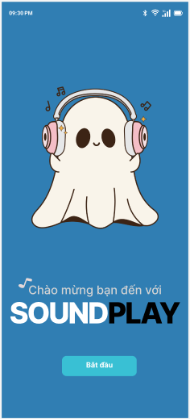
    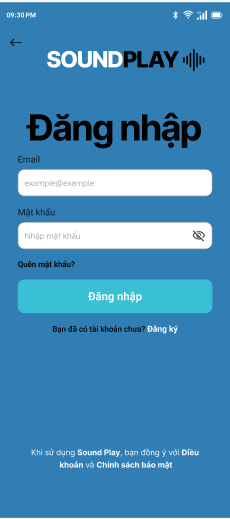
  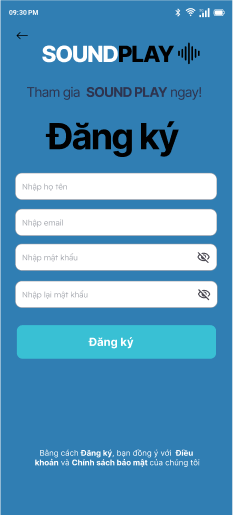
</p>

### 🔑 Màn hình Quên mật khẩu
<p align="center">
  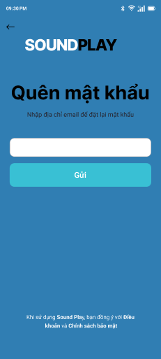
    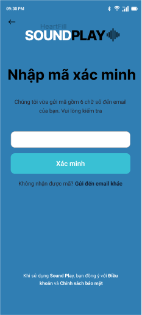
  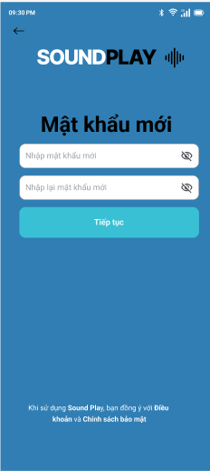
</p>


### 🏠 Màn hình Trang chủ
<p align="center">
  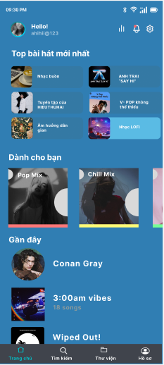
</p>

### 🎵 Màn hình Trình phát nhạc
<p align="center">
  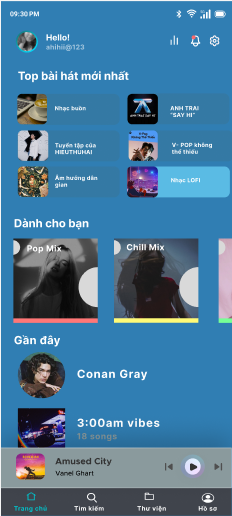
    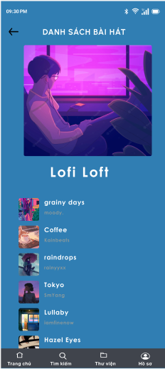
  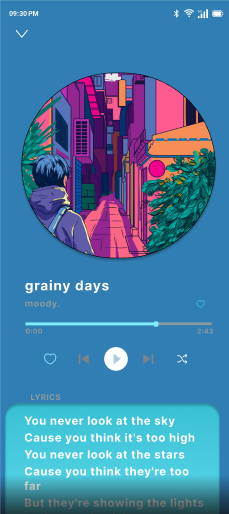
</p>

### 📚 Màn hình Thư viện
<p align="center">
  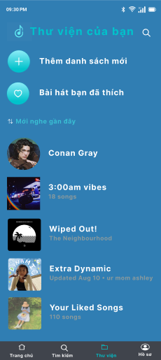
    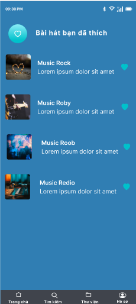
  
</p>

### 📚 Màn hình tìm kiếm
<p align="center">
    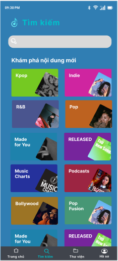
    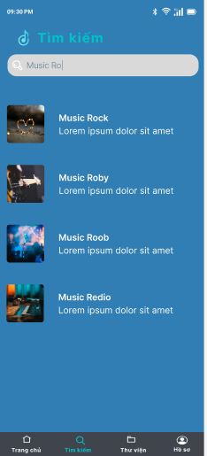

</p>

### 📚 Màn hình hồ sơ
<p align="center">
      

</p>


## 🚀 Hướng Dẫn Cài Đặt
- Bước 1: Clone dự án về máy:
   ```bash
   git clone https://github.com/HuuThanh0602/PTUD-N23-SoundPlay.git
   ```
- Bước 2: Mở project bằng Android Studio

- Bước 3: Kết nối thiết bị Android thật hoặc khởi động trình giả lập (Emulator)

- Bước 4: Build và chạy ứng dụng để trải nghiệm!
## 👨‍💻 Nhóm Phát Triển
- Nguyễn Hữu Thành
- Nguyễn Thuỳ Linh
- Hoàng Yến Nhi
